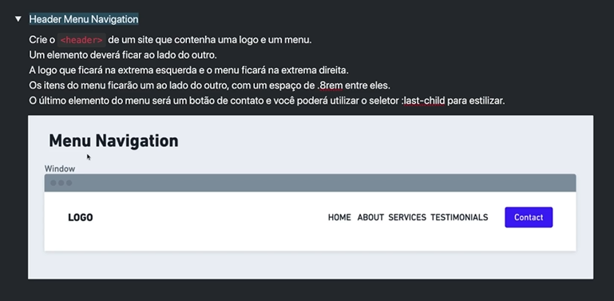

# Header Menu Navigation
</img>

```html
<header>
  <nav>
    <a href="">LOGO</a>
    <ul>
      <li>Home</li>
      <li>About</li>
      <li>Services</li>
      <li>Testimonials</li>
      <li>Contact</li>
    </ul>
  </nav>
</header>
```

```css
*{
  margin:0;
}

header{
  padding:4rem;
  background-color:lightblue;
}

nav{
  display:flex;
    align-items: center;
  justify-content: space-between;
}

ul{
  display:flex;
  gap: .8rem;
  align-items: center;
  list-style:none;
}

ul li:last-child{
  color:#fff;
  padding: .8rem;
  background-color: blue;
}
```